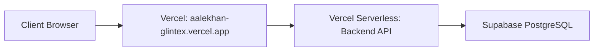

# GLINTEX Demo Deployment Plan

## Goal

Deploy a free demo environment using **Vercel** (frontend + backend) and **Supabase** (PostgreSQL only).

---

## Confirmed Requirements

| Requirement | Decision |
|-------------|----------|
| Architecture | Option 1: Vercel + Supabase DB |
| Demo data | Manual entry during demos |
| Duration | 15 days |
| URL preference | Custom alias `aalekhan-glintex` preferred |
| Auth | One pre-created admin user |
| Deployment method | CLI-based (Vercel + Supabase CLIs) |
| **Branch strategy** | **Separate branch `demo/vercel-supabase`** |
| **Branding** | **Aalekhan** (not GLINTEX on user-facing UI) |

---

## Isolation Guarantee

> [!CAUTION]
> **All demo changes are 100% isolated from your main project.**

| Isolation Layer | How It's Protected |
|-----------------|--------------------|
| Git | Separate branch `demo/vercel-supabase` - `main` untouched |
| Database | New Supabase project - your local/production DB unaffected |
| Deployment | Separate Vercel projects - no connection to VPS/Docker deployment |
| Branding | Only affects demo branch files |

```bash
# Create demo branch from main
git checkout main
git pull origin main
git checkout -b demo/vercel-supabase
```

---

## Aalekhan Branding

User-facing changes (demo branch only):

| Location | Current | Demo |
|----------|---------|------|
| Sidebar title | GLINTEX | Aalekhan |
| Sidebar subtitle | Inventory System | Stock Management |
| Mobile header | GLINTEX | Aalekhan |
| Browser tab/title | GLINTEX | Aalekhan |
| URLs | N/A | `aalekhan.vercel.app` |

**Files to modify:**
- [apps/frontend/src/components/layouts/DashboardLayout.jsx](file:///Volumes/MacSSD/Development/CursorAI_Project/GLINTEX/apps/frontend/src/components/layouts/DashboardLayout.jsx)
- [apps/frontend/index.html](file:///Volumes/MacSSD/Development/CursorAI_Project/GLINTEX/apps/frontend/index.html) (page title)

---

## Architecture



---

## Changes Required

### Backend

#### [MODIFY] [apps/backend/src/server.js](file:///Volumes/MacSSD/Development/CursorAI_Project/GLINTEX/apps/backend/src/server.js)
Add demo mode check to disable WhatsApp/backups:
```javascript
if (process.env.DEMO_MODE !== 'true') {
  startWhatsapp();
  await initBackupScheduler();
} else {
  console.log('Demo mode: WhatsApp and Backup services disabled');
}
```

#### [NEW] `apps/backend/api/index.js`
Vercel serverless entry point:
```javascript
import app from '../src/app.js';
export default app;
```

#### [NEW] `apps/backend/vercel.json`
```json
{
  "version": 2,
  "builds": [{ "src": "api/index.js", "use": "@vercel/node" }],
  "routes": [{ "src": "/(.*)", "dest": "api/index.js" }]
}
```

### Frontend

#### [NEW] `apps/frontend/vercel.json`
```json
{
  "rewrites": [{ "source": "/(.*)", "destination": "/index.html" }]
}
```

---

## Deployment Steps (CLI-Based)

### Phase 1: Create Supabase Database

```bash
# 1. Login to Supabase (if not already)
supabase login

# 2. Create new project
supabase projects create glintex-demo --org-id <your-org-id> --db-password <secure-password> --region ap-south-1

# 3. Get database connection strings from Supabase dashboard
# Copy: DATABASE_URL (pooler) and DIRECT_URL (direct)
```

### Phase 2: Apply Code Changes

I will create:
- `apps/backend/api/index.js` - Vercel serverless entry
- `apps/backend/vercel.json` - Backend routing config
- `apps/frontend/vercel.json` - Frontend SPA config
- Update [apps/backend/src/server.js](file:///Volumes/MacSSD/Development/CursorAI_Project/GLINTEX/apps/backend/src/server.js) - Demo mode check

### Phase 3: Deploy Backend to Vercel

```bash
cd apps/backend

# Deploy with environment variables
vercel --yes \
  --env DATABASE_URL="<supabase-pooler-url>" \
  --env DIRECT_URL="<supabase-direct-url>" \
  --env DEMO_MODE="true" \
  --env DEFAULT_ADMIN_PASSWORD="<admin-password>"

# Set production alias
vercel alias set <deployment-url> aalekhan-glintex-api.vercel.app
```

### Phase 4: Run Prisma Migration

```bash
cd apps/backend

# Apply schema to Supabase DB
DATABASE_URL="<supabase-direct-url>" npx prisma migrate deploy
```

### Phase 5: Deploy Frontend to Vercel

```bash
cd apps/frontend

# Deploy with API base URL
vercel --yes \
  --env VITE_API_BASE="https://aalekhan-glintex-api.vercel.app"

# Set production alias
vercel alias set <deployment-url> aalekhan-glintex.vercel.app
```

---

## Pre-Created Admin User

The backend auto-creates a default admin on first boot:
- **Username**: `admin`
- **Password**: Set via `DEFAULT_ADMIN_PASSWORD` env variable

If not set, a random password is generated and logged to the console.

---

## Verification Tests

After deployment, I will run comprehensive tests to verify everything works:

### Phase 1: Infrastructure Tests

| Test | Command/Action | Expected Result |
|------|----------------|-----------------|
| Backend reachable | `curl https://aalekhan-glintex-api.vercel.app/api/health` | Returns `{"ok": true}` |
| Database connected | `curl https://aalekhan-glintex-api.vercel.app/api/db` | Returns data structure |
| Auth endpoint | `curl https://aalekhan-glintex-api.vercel.app/api/auth/status` | Returns `{"hasUsers": true}` |
| Frontend loads | Open `aalekhan-glintex.vercel.app` | React app renders |

### Phase 2: Functional Tests (Browser)

| Test | Action | Expected Result |
|------|--------|-----------------|
| Login | Login with admin credentials | Redirects to `/app/inbound` |
| Create Lot | Add new lot in Inbound | Lot appears in list |
| Data Persistence | Refresh page | Lot still visible |
| Stock View | Navigate to Stock | Shows created lot |
| Cross-device | Open on mobile | Same data visible |

### Phase 3: Demo-Specific Tests

| Test | Expected Result |
|------|-----------------|
| WhatsApp disabled | No WhatsApp initialization logs |
| Backup disabled | No backup scheduler logs |
| Admin created | Can login with configured password |

---

## Demo Limitations

| Feature | Status | Reason |
|---------|--------|--------|
| WhatsApp notifications | ❌ Disabled | Requires Puppeteer |
| Automated backups | ❌ Disabled | No persistent storage |
| Label printing | ⚠️ Browser print only | Requires local service |
| Google Drive backup | ❌ Disabled | No OAuth setup |

---

## Execution Steps Summary

1. **Create branch** `demo/vercel-supabase`
2. **Create Supabase project** via CLI
3. **Apply code changes** (vercel.json, serverless adapter)
4. **Deploy backend** to Vercel
5. **Run Prisma migrations**
6. **Deploy frontend** to Vercel  
7. **Set custom aliases** (aalekhan-glintex)
8. **Run verification tests**
9. **Confirm demo is live**
